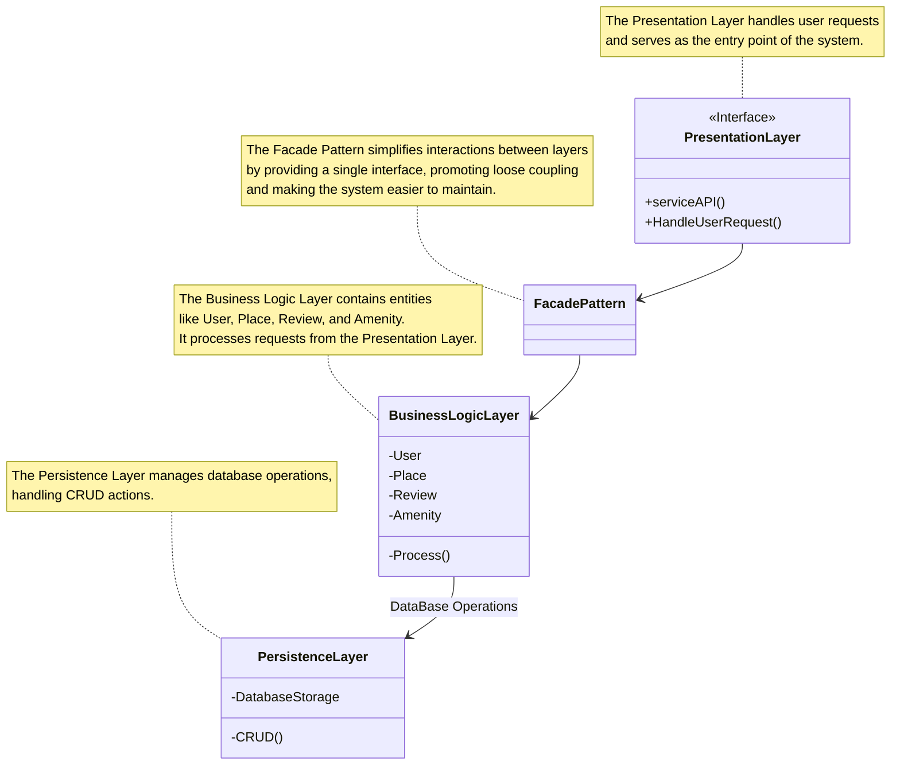

```mermaid
classDiagram

note for PresentationLayer "The Presentation Layer handles user requests
and serves as the entry point of the system."


class PresentationLayer {
    <<Interface>>

    +serviceAPI()
    +HandleUserRequest()
}

note for FacadePattern "The Facade Pattern simplifies interactions between layers
by providing a single interface, promoting loose coupling
and making the system easier to maintain."

class FacadePattern

note for BusinessLogicLayer "The Business Logic Layer contains entities
like User, Place, Review, and Amenity.
It processes requests from the Presentation Layer."

class BusinessLogicLayer {
    -User
    -Place
    -Review
    -Amenity
    -Process()
}

note for PersistenceLayer "The Persistence Layer manages database operations,
 handling CRUD actions."


class PersistenceLayer {
    -DatabaseStorage
    -CRUD()
}

PresentationLayer --> FacadePattern
FacadePattern --> BusinessLogicLayer
BusinessLogicLayer --> PersistenceLayer : DataBase Operations
```
