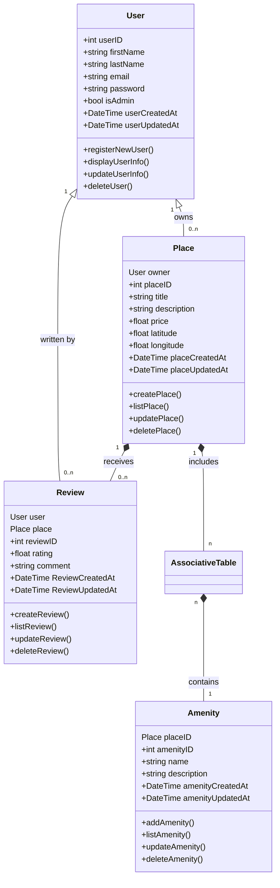

```mermaid
classDiagram

class User {
    +int userID
    +string firstName
    +string lastName
    +string email
    +string password
    +bool isAdmin
    +DateTime userCreatedAt
    +DateTime userUpdatedAt
    +registerNewUser()
    +displayUserInfo()
    +updateUserInfo()
    +deleteUser()
}

class Place {
    User owner
    +int placeID
    +string title
    +string description
    +float price
    +float latitude
    +float longitude
    +DateTime placeCreatedAt
    +DateTime placeUpdatedAt
    +createPlace()
    +listPlace()
    +updatePlace()
    +deletePlace()
}

class Review {
    User user
    Place place
    +int reviewID
    +float rating
    +string comment
    +DateTime ReviewCreatedAt
    +DateTime ReviewUpdatedAt
    +createReview()
    +listReview()
    +updateReview()
    +deleteReview()
}

class Amenity {
    Place placeID
    +int amenityID
    +string name
    +string description
    +DateTime amenityCreatedAt
    +DateTime amenityUpdatedAt
    +addAmenity()
    +listAmenity()
    +updateAmenity()
    +deleteAmenity()
}

class AssociativeTable

User "1" <|-- "0..n" Place : owns
User "1" <|-- "0..n" Review : written by
Place "1" *-- "0..n" Review : receives
Place "1" *-- "n" AssociativeTable: includes
AssociativeTable "n" *-- "1" Amenity: contains
```
