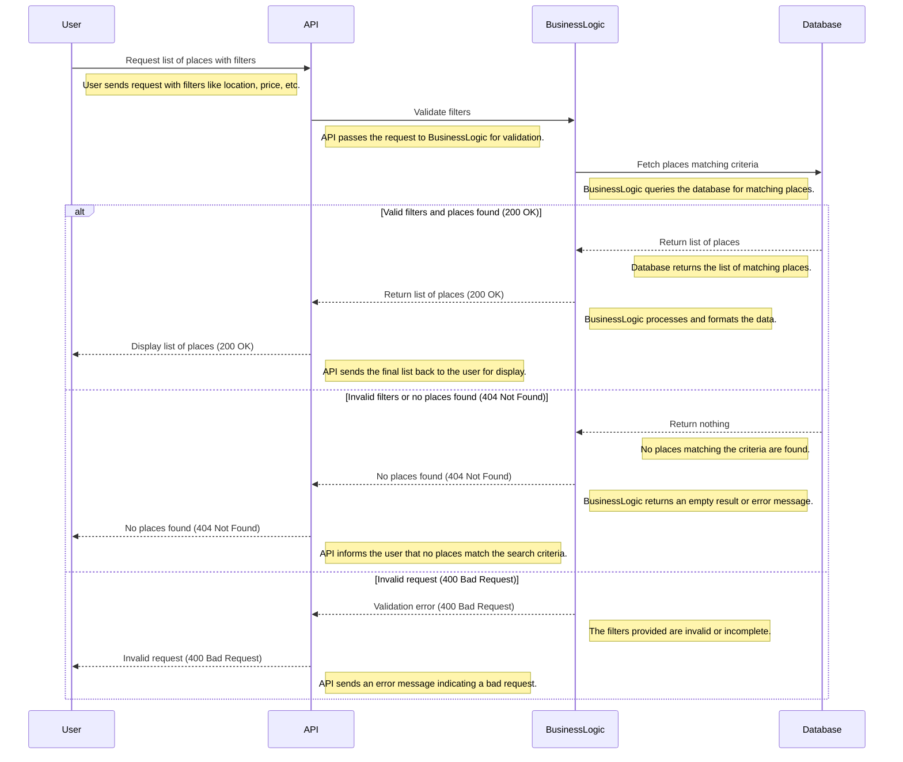

```mermaid
sequenceDiagram
    participant User
    participant API
    participant BusinessLogic
    participant Database

    User->>API: Request list of places with filters
    note right of User: User sends request with filters like location, price, etc.

    API->>BusinessLogic: Validate filters
    note right of API: API passes the request to BusinessLogic for validation.

    BusinessLogic->>Database: Fetch places matching criteria
    note right of BusinessLogic: BusinessLogic queries the database for matching places.

    alt Valid filters and places found (200 OK)
        Database-->>BusinessLogic: Return list of places
        note left of Database: Database returns the list of matching places.
        BusinessLogic-->>API: Return list of places (200 OK)
        note right of BusinessLogic: BusinessLogic processes and formats the data.
        API-->>User: Display list of places (200 OK)
        note right of API: API sends the final list back to the user for display.
    else Invalid filters or no places found (404 Not Found)
        Database-->>BusinessLogic: Return nothing
        note left of Database: No places matching the criteria are found.
        BusinessLogic-->>API: No places found (404 Not Found)
        note right of BusinessLogic: BusinessLogic returns an empty result or error message.
        API-->>User: No places found (404 Not Found)
        note right of API: API informs the user that no places match the search criteria.
    else Invalid request (400 Bad Request)
        BusinessLogic-->>API: Validation error (400 Bad Request)
        note right of BusinessLogic: The filters provided are invalid or incomplete.
        API-->>User: Invalid request (400 Bad Request)
        note right of API: API sends an error message indicating a bad request.
    end
```
