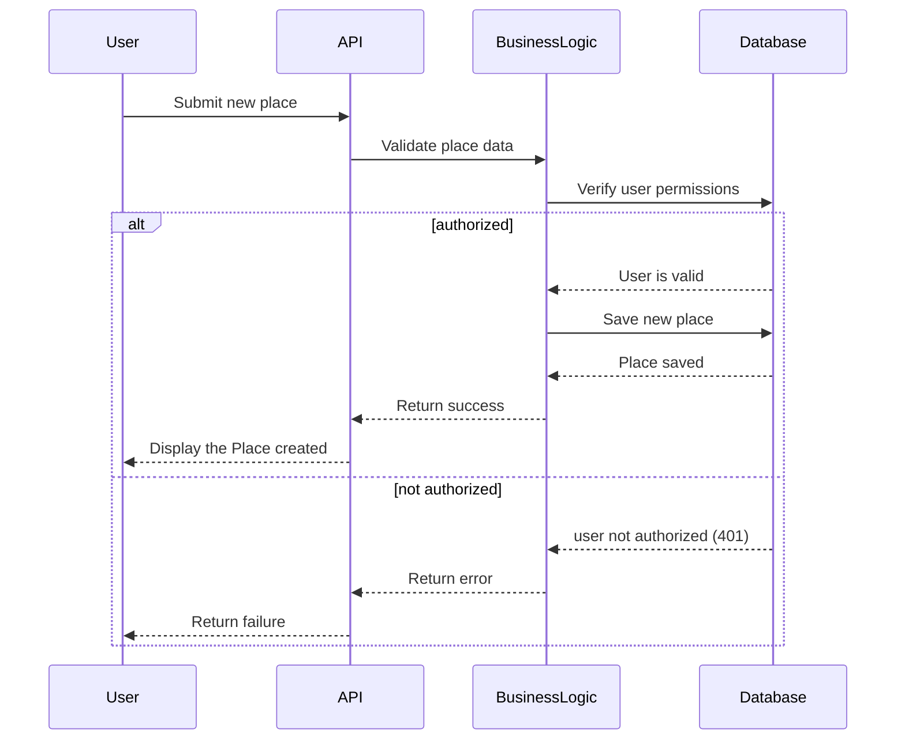

```mermaid
sequenceDiagram
    participant User
    participant API
    participant BusinessLogic
    participant Database

    User->>API: Submit new place
    API->>BusinessLogic: Validate place data
    BusinessLogic->>Database: Verify user permissions

    alt authorized
        Database-->>BusinessLogic: User is valid
        BusinessLogic->>Database: Save new place
        Database-->>BusinessLogic: Place saved
        BusinessLogic-->>API: Return success
        API-->>User: Display the Place created
    else not authorized
        Database-->>BusinessLogic: user not authorized (401)
        BusinessLogic-->>API: Return error
        API-->>User: Return failure
    end
```
