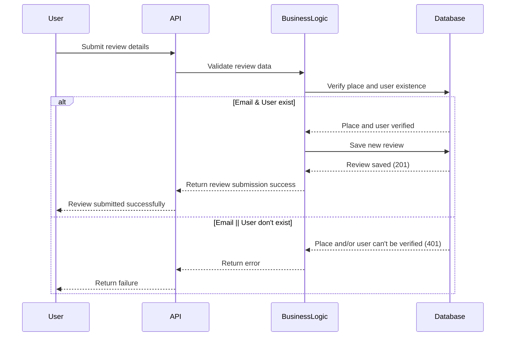

```mermaid
sequenceDiagram
    participant User
    participant API
    participant BusinessLogic
    participant Database
    User->>API: Submit review details
    API->>BusinessLogic: Validate review data
    BusinessLogic->>Database: Verify place and user existence

    alt Email & User exist
        Database-->>BusinessLogic: Place and user verified
        BusinessLogic->>Database: Save new review
        Database-->>BusinessLogic: Review saved (201)
        BusinessLogic-->>API: Return review submission success
        API-->>User: Review submitted successfully
    else Email || User don't exist
        Database-->>BusinessLogic: Place and/or user can't be verified (401)
        BusinessLogic-->>API: Return error
        API-->>User: Return failure
    end
```
