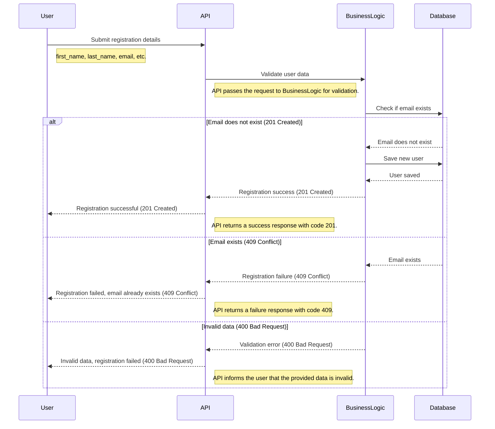

```mermaid
sequenceDiagram

    participant User
    participant API
    participant BusinessLogic
    participant Database

    User->>API: Submit registration details
    note right of User: first_name, last_name, email, etc.

    API->>BusinessLogic: Validate user data
    note right of API: API passes the request to BusinessLogic for validation.

    BusinessLogic->>Database: Check if email exists

    alt Email does not exist (201 Created)
        Database-->>BusinessLogic: Email does not exist
        BusinessLogic->>Database: Save new user
        Database-->>BusinessLogic: User saved
        BusinessLogic-->>API: Registration success (201 Created)
        API-->>User: Registration successful (201 Created)
        note right of API: API returns a success response with code 201.
    else Email exists (409 Conflict)
        Database-->>BusinessLogic: Email exists
        BusinessLogic-->>API: Registration failure (409 Conflict)
        API-->>User: Registration failed, email already exists (409 Conflict)
        note right of API: API returns a failure response with code 409.
    else Invalid data (400 Bad Request)
        BusinessLogic-->>API: Validation error (400 Bad Request)
        API-->>User: Invalid data, registration failed (400 Bad Request)
        note right of API: API informs the user that the provided data is invalid.
    end
```
