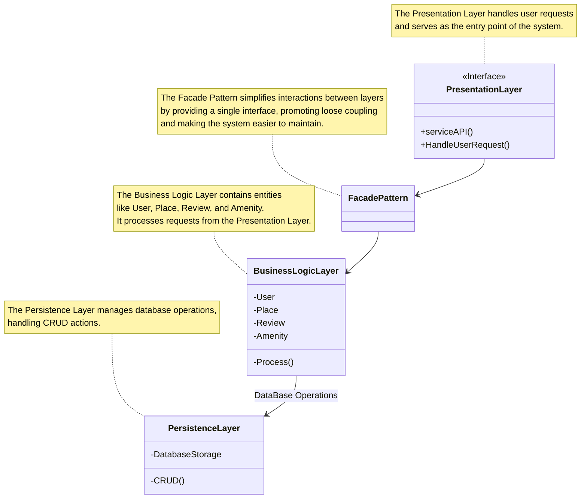
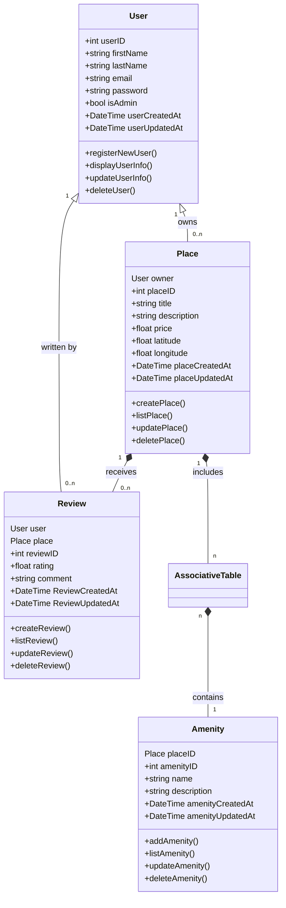
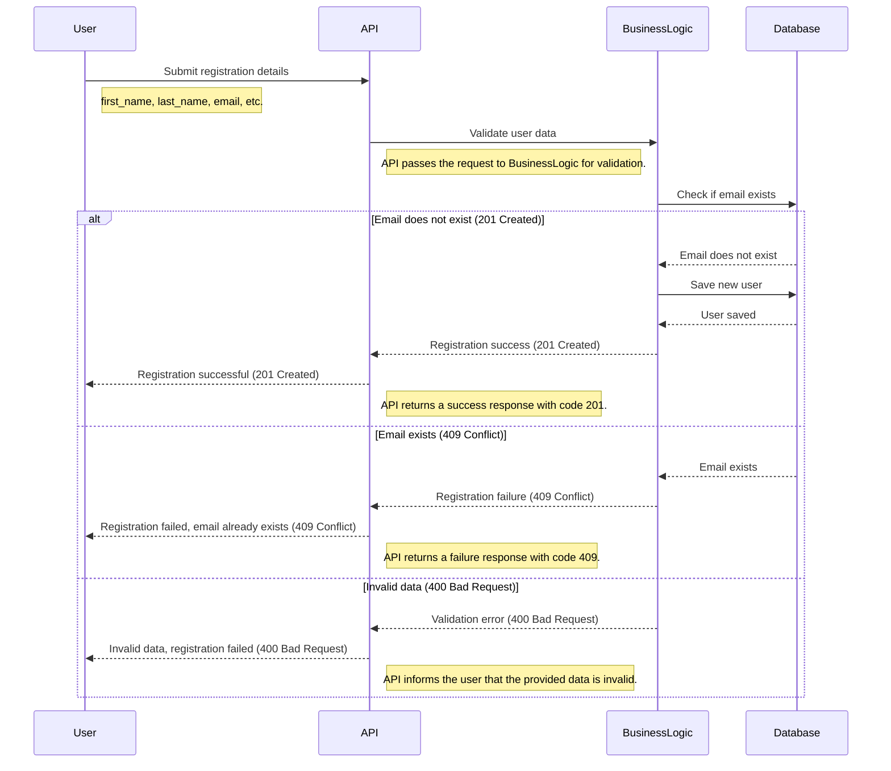
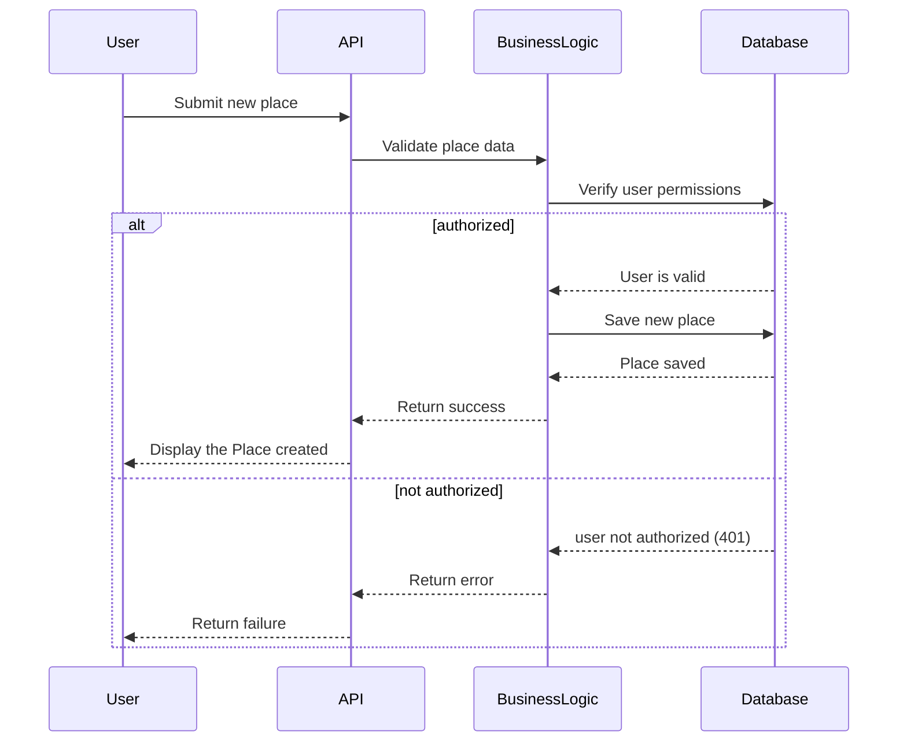
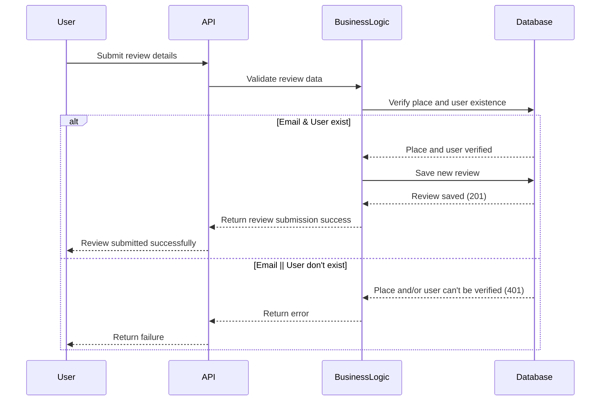
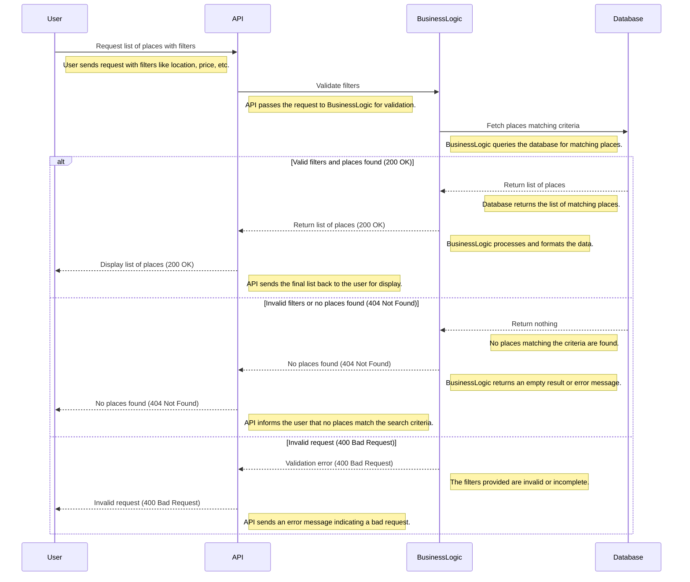

# Technical Document for HBnB Evolution

## Table of Contents

- [Introduction](#introduction)
- [High-Level Architecture](#high-level-architecture)
  - [High-Level Package Diagram](#high-level-package-diagram)
  - [High-Level Package Diagram Explanation](#high-level-package-diagram-explanation)
  - [Purpose of the High-Level Diagram](#purpose-of-the-high-level-diagram)
  - [Key Components](#key-components)
  - [Design Decisions and Rationale](#design-decisions-and-rationale)
  - [Fit into Overall Architecture](#fit-into-overall-architecture)
- [Business Logic Layer](#business-logic-layer)
  - [Detailed Class Diagram](#detailed-class-diagram)
  - [Class Diagram Overview](#class-diagram-overview)
  - [Purpose of the Class Diagram](#purpose-of-the-class-diagram)
  - [Key Components](#key-components)
  - [Design Decisions and Rationale](#design-decisions-and-rationale)
  - [Fit into Overall Architecture](#fit-into-overall-architecture)
- [API Interaction Flow](#api-interaction-flow)
  - [1. User Registration Sequence](#1-user-registration-sequence)
    - [Purpose of the User Registration](#purpose-of-the-user-registration)
    - [Key Components of User Registration](#key-components-of-user-registration)
    - [Design Decisions of User Registration](#design-decisions-of-user-registration)
    - [Architecture Fit of User Registration](#architecture-fit-of-user-registration)
  - [2. Place Submission Sequence](#2-place-submission-sequence)
    - [Purpose of the Place Submission](#purpose-of-the-place-submission)
    - [Key Components of the Place Submission](#key-components-of-the-place-submission)
    - [Design Decisions of the Place Submission](#design-decisions-of-the-place-submission)
    - [Architecture Fit of the Place Submission](#architecture-fit-of-the-place-submission)
  - [3. Review Submission Sequence](#3-review-submission-sequence)
    - [Purpose of the Submission Sequence](#purpose-of-the-submission-sequence)
    - [Key Components of the Submission Sequence](#key-components-of-the-submission-sequence)
    - [Design Decisions of the Submission Sequence](#design-decisions-of-the-submission-sequence)
    - [Architecture Fit of the Submission Sequence](#architecture-fit-of-the-submission-sequence)
  - [4. Place List Retrieval Sequence](#4-place-list-retrieval-sequence)
    - [Purpose of the List Retrieval Sequence](#purpose-of-the-list-retrieval-sequence)
    - [Key Components of the List Retrieval Sequence](#key-components-of-the-list-retrieval-sequence)
    - [Design Decisions of the List Retrieval Sequence](#design-decisions-of-the-list-retrieval-sequence)
    - [Architecture Fit of the List Retrieval Sequence](#architecture-fit-of-the-list-retrieval-sequence)
  - [Conclusion](#conclusion)

---

---

## Introduction

The purpose of this technical document is to provide a detailed blueprint for the development of the **HBnB Evolution** application, an innovative platform designed to facilitate short-term rental management, similar to AirBnB. This document aims to outline the architectural framework, business logic, and system interactions that underpin the application.

The HBnB Evolution project is focused on delivering a user-friendly interface that allows users to manage their rental properties, leave reviews, and access various amenities associated with each place. This technical document serves as a vital resource for developers, ensuring clarity and consistency throughout the implementation process. By delineating the application's structure, including its layered architecture and key entities, this document will guide the development team in adhering to established business rules and requirements, ultimately streamlining the project’s execution and enhancing the overall quality of the application.

Within this document, you will find:

- An overview of the high-level architecture, including a package diagram that illustrates the layered structure of the application and the facade pattern utilized for communication between components.

- A detailed class diagram for the Business Logic Layer, which highlights the key entities (User, Place, Review, and Amenity), their attributes, methods, and the relationships between them.

- Sequence diagrams that illustrate the interaction flow for selected API calls, detailing the exchanges of information and control among various components of the system.

---

---

## High-Level Architecture

### High-Level Package Diagram

## High-Level Package Diagram Explanation

### Purpose of the High-Level Diagram

The purpose of this UML diagram is to depict the structure and organization of the application, showing the key components involved in the user-facing operations, business logic, and data management. It helps to visualize how the system is broken down into distinct layers, each responsible for a specific part of the application. Additionally, it highlights the **Facade Pattern**, which serves as an intermediary, ensuring smooth communication between the layers while abstracting complexity.

### Key Components

1. **Presentation Layer**:

   - **Purpose**: This is the entry point of the system where user requests are received. It interacts with the user-facing parts of the application, handling requests and directing them to the business logic.
   - **Key Methods**:
     - `serviceAPI()`: Manages API calls.
     - `HandleUserRequest()`: Handles user inputs before sending them to the business logic.

2. **Facade**:

   - **Purpose**: The **Facade Pattern** acts as a mediator between the Presentation Layer and the Business Logic Layer. It simplifies the interaction by providing a single interface, reducing the complexity and promoting loose coupling between components.
   - **Rationale**: This pattern ensures that the Presentation Layer does not interact directly with the business logic, making future maintenance and modifications more manageable.

3. **Business Logic Layer**:

   - **Purpose**: This layer is responsible for processing user requests and managing the core business rules of the application.
   - **Entities**:
     - `User`, `Place`, `Review`, `Amenity`: Each entity represents a core part of the system's functionality.
   - **Key Method**:
   - `Process()`: Processes user requests, applies business rules, and interacts with the Persistence Layer for data storage and retrieval.

4. **Persistence Layer**:
   - **Purpose**: This layer handles interactions with the database, performing CRUD (Create, Read, Update, Delete) operations.
   - **Key Components**:
     - `DatabaseStorage`: Manages data storage and access.
     - `CRUD()`: Methods responsible for performing the necessary database operations.

### Design Decisions and Rationale

- **Layered Architecture**: This design follows a **layered architecture** to promote separation of concerns. Each layer has a distinct responsibility:

  - Presentation Layer handles user requests.
  - Business Logic Layer manages the application's core functionality.
  - Persistence Layer manages database access.

- **Facade Pattern**: Using the **Facade Pattern** ensures that the Presentation Layer is decoupled from the Business Logic Layer. This separation provides flexibility, allowing changes to the business logic without affecting how the application interacts with users.

- **Persistence Layer**: The decision to separate data access into a distinct layer allows the system to scale and evolve independently of the business logic, making it easier to change or replace the database structure without affecting other parts of the application.

### Fit into Overall Architecture

This class diagram illustrates the layered architecture of the **HBnB Evolution** application, emphasizing the **Facade Pattern** as a mediator between the Presentation and Business Logic layers. Each layer—Presentation, Business Logic, and Persistence—has specific responsibilities, ensuring a clean separation of concerns. This design promotes maintainability and scalability while simplifying future updates. The **Persistence Layer** is responsible for data storage and retrieval, facilitating smooth database interactions.

---

---

## Business Logic Layer

### Detailed Class Diagram

### Class Diagram Overview

This class diagram depicts the core entities of the **HBnB Evolution** application, highlighting their relationships and attributes.

### Purpose of the Class Diagram

The diagram illustrates the structure of the main entities involved in user interactions, including **User**, **Place**, **Review**, and **Amenity**. It provides a clear view of how these entities are interconnected, facilitating understanding of the application's architecture.

### Key Components of the Class Diagram

1. **User**: Represents application users with attributes for user identification, personal information, and methods for registration, display, updating, and deletion.

2. **Place**: Describes locations that users can create or list, containing attributes such as title, description, price, and geographic coordinates. It includes methods for place management.

3. **Review**: Associates users with places, capturing user feedback through ratings and comments. It supports operations for creating, listing, updating, and deleting reviews.

4. **Amenity**: Links to places, representing features or services available. It allows for CRUD operations on amenities.

5. **AssociativeTable**: Acts as a linking entity between places and amenities, capturing the many-to-many relationship.

### Design Decisions and Rationale of the Class Diagram

- The diagram uses clear class relationships to indicate ownership (User owns Place) and associations (Review relates users and places).
- The **AssociativeTable** serves to manage the many-to-many relationship between **Place** and **Amenity**, enhancing data organization and retrieval.

### Fit of the Class Diagram into Overall Architecture

This class diagram fits into the overall design of the **HBnB Evolution** application by defining the foundational entities and their interactions. It underscores the importance of relationships in maintaining data integrity and supporting user functionalities, ultimately contributing to the application's scalability and maintainability.

---

---

## API Interaction Flow

This document presents a summary of four key sequence diagrams illustrating the interactions among User, API, Business Logic, and Database components in the **HBnB Evolution** application. Each diagram captures a critical process in the system.

## 1. User Registration Sequence

### Purpose of the User Registration

To depict the user registration process, validating user data and ensuring uniqueness of email.

### Key Components of User Registration

- **User**: Submits registration details.
- **API**: Forwards request to Business Logic for validation.
- **Business Logic**: Checks for existing emails and saves new users.
- **Database**: Handles data storage.

### Design Decisions of User Registration

- Validates email uniqueness.
- Returns success (201 Created) or conflict (409 Conflict) messages based on email status.
- Ensures proper error handling for invalid data (400 Bad Request).

### Architecture Fit of User Registration

Illustrates the user onboarding flow and emphasizes input validation.

## 2. Place Submission Sequence

### Purpose of the Place Submission

To outline the process for users submitting new places while checking their permissions.

### Key Components of the Place Submission

- **User**: Submits a request to create a new place.
- **API**: Validates the request.
- **Business Logic**: Checks user authorization.
- **Database**: Saves the new place if authorized.

### Design Decisions of the Place Submission

- Incorporates authorization checks.
- Returns success or failure messages based on user permissions (401 Unauthorized).

### Architecture Fit of the Place Submission

Highlights the importance of user roles and permissions in place creation.

## 3. Review Submission Sequence

### Purpose of the Submission Sequence

To illustrate the process for users submitting reviews for places, validating user and place existence.

### Key Components of the Submission Sequence

- **User**: Submits review details.
- **API**: Passes data for validation.
- **Business Logic**: Verifies the existence of the user and place.
- **Database**: Saves the new review.

### Design Decisions of the Submission Sequence

- Checks for valid user and place before submission.
- Returns success (201 Created) or error (401 Unauthorized) messages.

### Architecture Fit of the Submission Sequence

Demonstrates the interaction between users and places through reviews, enhancing user engagement.

## 4. Place List Retrieval Sequence

### Purpose of the List Retrieval Sequence

To depict the process of retrieving a list of places based on user-defined filters.

### Key Components of the List Retrieval Sequence

- **User**: Requests a list of places with filters.
- **API**: Forwards the request for validation.
- **Business Logic**: Queries the Database for matching places.
- **Database**: Returns filtered place data.

### Design Decisions of the List Retrieval Sequence

- Validates filters and checks for matching places.
- Returns appropriate success (200 OK) or error messages (404 Not Found or 400 Bad Request).

### Architecture Fit of the List Retrieval Sequence

Integrates user interaction with the data retrieval process, ensuring a responsive experience.

## Conclusion

This document has provided a detailed overview of the architecture and functionality of the **HBnB Evolution** application, highlighting the relationships between various components through the package, class, and sequence diagrams. Each section was designed to illustrate the dynamic interactions and static structure of the system, ensuring a clear understanding for all stakeholders involved.
