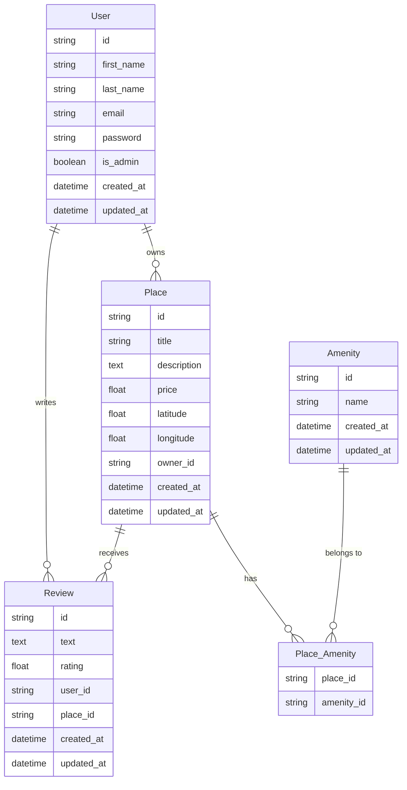
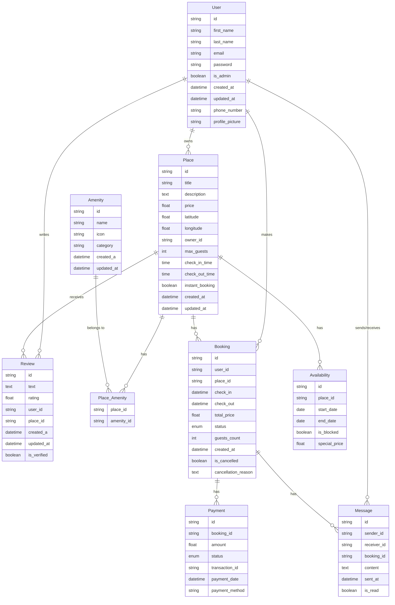

# HBnB Project: A Clone of ABnB

## How to test the part4 of the HBnB project

### 1. Go to part4

```bash
cd ~/Repository/holbertonschool-hbnb/part4/
```

### 2. Install the environment

[Installation instructions](#installation-instructions)

### 3. Open a new shell and Create a new user:

```bash
curl -X POST http://127.0.0.1:5000/api/v1/users/ \
  -H "Content-Type: application/json" \
  -d '{
    "first_name": "Choisir un prénom",
    "last_name": "Choisir un nom",
    "email": "XXXXXXXXX@gmail.com",
    "password": "Choisir un mot de passe"
  }'
```

### 4. Add a review on any available place

- You're on index page, choose a place by clicking on `View Details`.
- In the review form, write a review.
- Give a score to the place.
- Submit.
- The page reloads. Your is registered.

## Overview of the setup

The project is organize in the following structure :

```bash
hbnb/
├── app/
│ ├── __init__.py
│ ├── api/
│ │ ├── __init__.py
│ │ ├── v1/
│ │ ├── __init__.py
│ │ ├── users.py
│ │ ├── places.py
│ │ ├── reviews.py
│ │ ├── amenities.py
│ ├── models/
│ │ ├── __init__.py
│ │ ├── user.py
│ │ ├── place.py
│ │ ├── review.py
│ │ ├── amenity.py
│ ├── services/
│ │ ├── __init__.py
│ │ ├── facade.py
│ ├── persistence/
│ ├── __init__.py
│ ├── repository.py
├── run.py
├── config.py
├── requirements.txt
├── README.md
```

## Purpose of each directories and files:

- The `app/` directory contains the core application code.
- The `api/` subdirectory houses the API endpoints, organized by version (v1/).
- The `models/` subdirectory contains the business logic classes (e.g., user.py, place.py).
- The `services/` subdirectory is where the Facade pattern is implemented, managing the interaction between layers.
- The `persistence/` subdirectory is where the in-memory repository is implemented. This will later be replaced by a database-backed solution using SQL Alchemy.
- `run.py` is the entry point for running the Flask application.
- `config.py` will be used for configuring environment variables and application settings.
- `requirements.txt` will list all the Python packages needed for the project.
- `README.md` contains a brief overview of the project.

## Installation instructions

### Create an environment

```macOS/Linux
$ mkdir myproject
$ cd myproject
$ python3 -m venv .venv
```

```Windows
> mkdir myproject
> cd myproject
> py -3 -m venv .venv
```

#### Activate the environment

```macOS/Linux
$ . .venv/bin/activate
```

```Windows
> .venv\Scripts\activate
```

#### Install all dependancies

```
pip install -r requirements.txt
```

#### Test the Initial setup

```
python run.py
```

#### Entity-Relationship (ER) diagrams

##### Actual Relationships



##### Possible future Relationships


